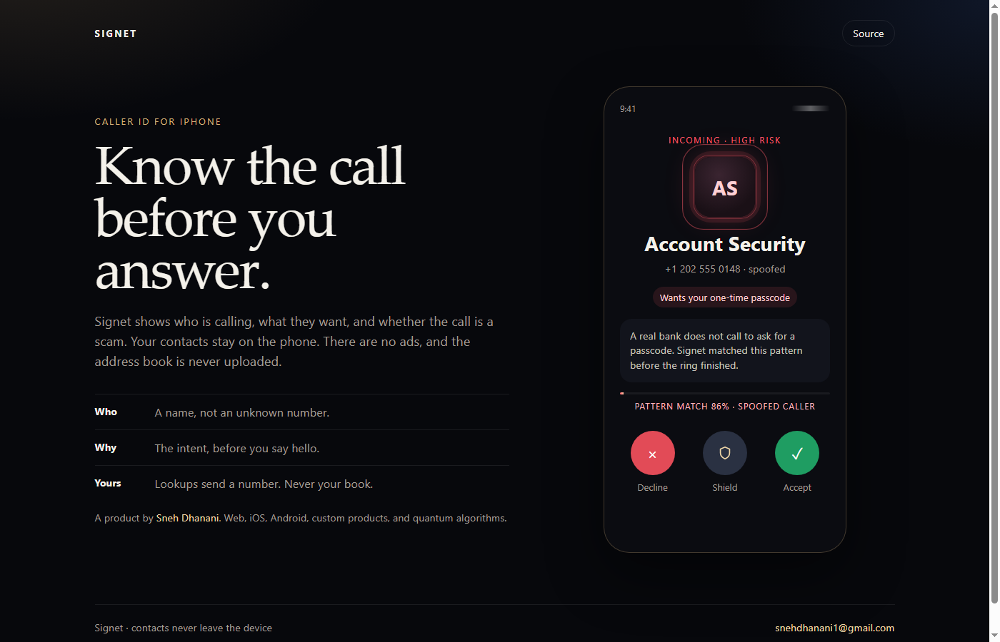

# Signet

Caller ID for iPhone. This repository publishes the call rules. The shipping app stays private.

`SignetCore` decides the risk of a call:

- A spoofed number, or a request for a passcode, is **high** risk.
- A known contact is **low** risk.
- Anyone else is **watch**.



The page at [dhananisneh.github.io/signet](https://dhananisneh.github.io/signet/) is the call screen. The rules live in `Sources/SignetCore`.

## Test

```bash
swift test
```

GitHub runs that on every push.

## Author

[Sneh Dhanani](https://github.com/DhananiSneh) · [snehdhanani1@gmail.com](mailto:snehdhanani1@gmail.com)
